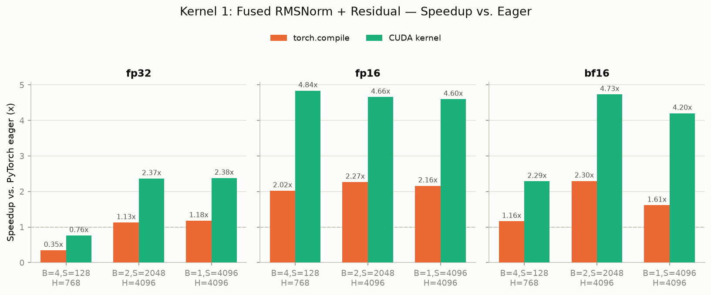
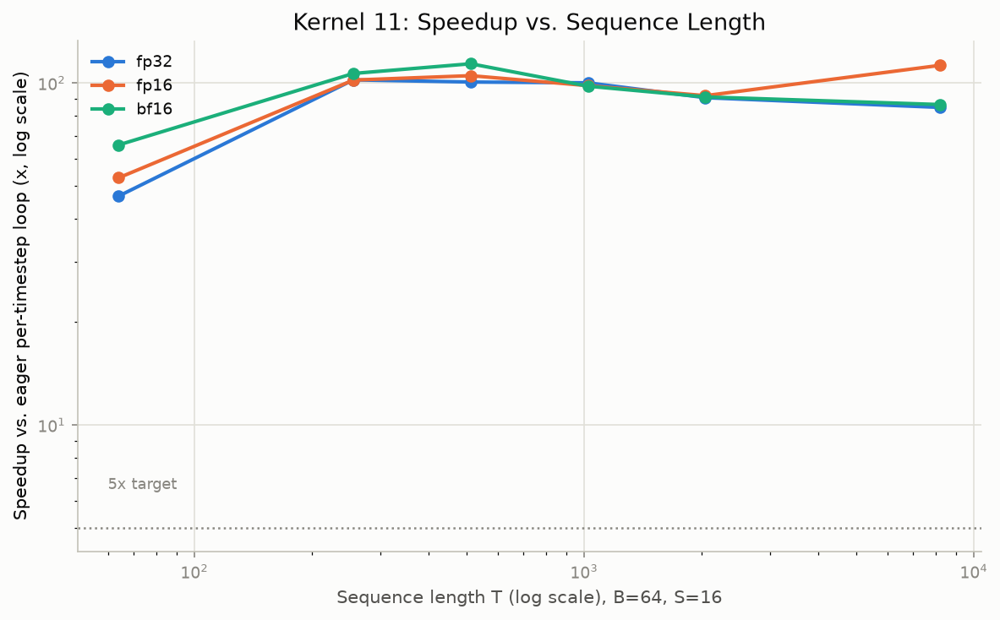
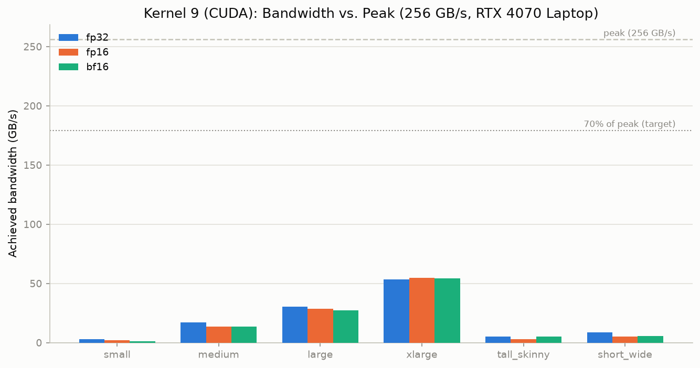
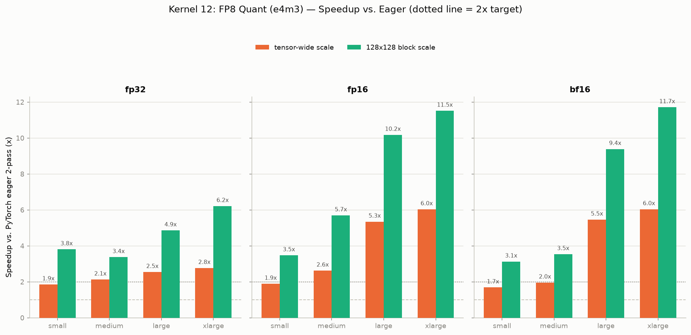

# Custom CUDA Kernels

**12 hand-written CUDA kernels for LLM, RAG, MoE, and graph workloads - wrapped in Rust and exposed to PyTorch as zero-copy, GPU-resident drop-in ops.**


This repository is a custom CUDA C++ kernel library developed from the ground up for LLM inference, retrieval systems, Mixture-of-Experts (MoE) models, and graph-based workloads. It implements a range of GPU kernels, including tiled GEMM, RMSNorm, SwiGLU, RoPE, fused cross-entropy loss, MoE routing and token permutation, cosine similarity top-k search, pairwise distance computation, spatiotemporal graph message passing, Viterbi decoding, and FP8 quantization.

Each kernel is integrated directly with PyTorch tensors through a Rust CFFI layer, without relying on additional C wrappers or intermediate memory copies. For CUDA tensors stored contiguously in memory, the library operates directly on the underlying GPU pointers using `data_ptr()`, allowing computations to run directly in VRAM with minimal overhead.

All kernels were evaluated on a real GPU environment using an RTX 4070 Laptop GPU with 256 GB/s peak memory bandwidth. Benchmarking was performed using CUDA events with L2 cache flushing between iterations to ensure more reliable measurements, rather than relying on simple wall-clock timing around cached execution paths.

The project documents both successful optimizations and approaches that did not achieve the expected performance improvements. The complete development process, including initial implementations, profiling results, optimization experiments, and performance analysis, is available in [`project_plan.md`](./project_plan.md).

---

## Table of Contents

1. [Motivation](#motivation)
2. [System Architecture](#system-architecture)
3. [Engineering Principles](#engineering-principles)
4. [Integration Proof: A Real Llama-3-8B Block](#integration-proof-a-real-llama-3-8b-block)
5. [The 12 Kernels](#the-12-kernels)
6. [Developer CLI (`custom_cuda_cli`)](#developer-cli-custom_cuda_cli)
7. [Installation and Usage](#installation-and-usage)
8. [Benchmarks and Visualizations](#benchmarks-and-visualizations)

---

## Motivation

PyTorch eager execution is not limited by Python performance. The main bottlenecks often come from how operations are mapped onto GPU hardware. In transformer workloads, three issues appear repeatedly: **memory bandwidth usage**, **unnecessary memory allocation**, and **CUDA kernel launch overhead**.

**Memory bandwidth limitations**. Modern GPUs can perform significantly more computations per second than they can move data through memory. For example, an RTX 4070 Mobile GPU can deliver tens of TFLOPS of compute while being limited to around 256 GB/s of memory bandwidth. Operations such as RMSNorm, SwiGLU, and RoPE are typically bandwidth-bound because they perform relatively few calculations compared to the amount of data they read and write.

When these operations are executed as separate PyTorch operations, intermediate results are repeatedly written back to and loaded from GPU memory. A fused kernel can combine these steps into a single operation, reducing unnecessary memory transfers by processing the data in one pass.

**Reducing intermediate memory usage**. Some operations can create large temporary tensors that significantly increase GPU memory consumption. For example, computing cross-entropy loss over a vocabulary of 128K tokens requires generating a logits tensor with shape [`batch·seq, 128256`] before applying softmax and calculating the loss. For large batches or long context lengths, this intermediate tensor can consume several gigabytes of VRAM despite being discarded immediately afterward.

Implementing the computation directly inside a custom kernel avoids materializing unnecessary intermediate results, reducing memory usage and allowing larger workloads to fit on the GPU.

**CUDA kernel launch overhead**. Each PyTorch operation typically results in a separate CUDA kernel launch. While the overhead of a single launch is small, repeated launches can become significant in workloads with many sequential operations. For example, a Viterbi decoder implemented with a Python loop may launch a separate kernel for every timestep in the sequence. With thousands of timesteps, the accumulated dispatch overhead can become a measurable portion of the runtime.

Custom kernels can reduce this overhead by combining multiple operations into a single execution. Persistent kernels can also keep the computation within one kernel launch by handling iterative work directly on the GPU.

The goal of this project is not to rely on specialized hardware features, but to improve GPU utilization by designing kernels that match the underlying workload. By combining operations where appropriate and providing a direct memory path between PyTorch tensors and CUDA kernels, the library reduces unnecessary data movement, intermediate allocations, and execution overhead.
## System Architecture

Four layers, each with one job:

```
  PyTorch
  torch.Tensor (CUDA, contiguous) - fp32 / fp16 / bfloat16 / fp8
        │
        │   data_ptr(), shape, dtype, current CUDA stream
        ▼
  Python Wrappers                                    custom_cuda/kernels/*.py
  allocate output tensor(s), call the native extension - no shape/dtype
  logic lives here; it's all pushed down into the Rust layer below
        │
        │   Bound<'_, PyAny> -> validated CudaTensorView
        ▼
  Rust CFFI + PyO3                                          src/kernels/*.rs
  validate device / dtype / contiguity / shape, map failures to PyErr
  pull the tensor's raw device pointer + the current torch CUDA stream
  call the extern "C" launcher - zero host-device copies, zero
  intermediate allocation
        │
        │   extern "C" launch_<kernel>_fwd(ptr, ..., stream)
        ▼
  C++ / CUDA Kernels                                     csrc/kernels/*.cu
  warp-shuffle reductions, register-blocked GEMM tiling, shared-memory
  staging, vectorized uint4 loads/stores, persistent kernels
```

The CUDA kernels in `csrc/kernels/*.cu` operate directly on the same device memory allocated and managed by PyTorch. There is no DLPack conversion, CPU memory staging, or additional allocation involved in the execution path. The Rust layer is responsible only for validating that a tensor can be safely passed to a raw CUDA kernel, including checking the device, data type, memory layout, and shape. It also retrieves the CUDA stream currently used by PyTorch so that custom kernel execution remains correctly synchronized with the rest of the model's computation.

The project does not rely on `setuptools`, `CMakeLists.txt`, or a separate native extension build process. Instead, the CUDA compilation is handled through `build.rs`, a standard Rust build script that runs automatically during the `cargo` or `maturin` build process.

During compilation, `build.rs` discovers the CUDA source files under `csrc/kernels/`, locates the installed CUDA toolkit using `CUDA_PATH` or `CUDA_HOME`, and compiles each kernel with `nvcc` using optimized build settings (`-O3`, `--use_fast_math`, `-arch=sm_89`, and `-std=c++17`).

On Windows, CUDA compilation requires `cl.exe` as the host compiler. Since it is not always available through the default system path, the build script uses the `cc` crate's MSVC detection mechanism to locate the compiler automatically and passes it to `nvcc` through the `-ccbin` option. This avoids requiring users to manually open a Visual Studio Developer Command Prompt before building.

The compiled CUDA object files are packaged into a static library and linked directly into the PyO3-based Python extension. As a result, running `maturin develop` handles the complete build process: compiling CUDA kernels, linking the Rust bindings, and installing the resulting `custom_cuda._native` extension module into the Python environment.

## Engineering Principles

The following principles were applied consistently across all 12 kernels in the repository.

**Zero-copy GPU residency.** Every kernel operates directly on the tensor memory already allocated by PyTorch on the GPU. No kernel performs `.cpu()`, `.to(device)`, or transfers data through host memory during execution. The Rust layer handles validation and pointer extraction, while the actual tensor data remains on the GPU throughout the computation.

**GPU-level benchmarking instead of wall-clock timing.** All performance results reported in this repository and in `project_plan.md` are generated from the scripts in `benchmarks/`. Measurements use CUDA events (`torch.cuda.Event(enable_timing=True)`) to capture GPU execution time accurately rather than relying on CPU wall-clock timers.

To reduce measurement noise, the benchmarks include L2 cache flushing between iterations using a 256 MB scratch buffer, preventing subsequent runs from benefiting from cached data. Each benchmark includes a warmup phase followed by at least 100 measured iterations, with results reported using the median and interquartile range.

**Optimization driven by profiling results.** Each kernel was first implemented with a straightforward design, benchmarked, and then optimized based on observed bottlenecks. Optimizations were evaluated through measurement rather than assumptions about expected improvements.

Some optimization attempts did not provide benefits and were removed. For example:

- Kernel 1's shared-memory row-staging approach showed no improvement because the targeted memory access pattern was already benefiting from L2 cache, while the added shared-memory usage reduced occupancy and caused around a 5% slowdown.

- Kernel 9's increase of kBlockK from 8 to 16 produced no throughput improvement and reduced performance for some input sizes.

- Kernel 3's initial vectorization attempt introduced a launch configuration issue that made performance worse. The issue was identified, corrected, and documented instead of being included as an ineffective optimization.

These experiments and their measured results are documented in project_plan.md.

**Transparent performance reporting.** Performance targets are reported based on actual measurements, including cases where a kernel does not outperform the baseline. Kernel 5 (fused MatMul + bias) and Kernel 8 (fused cosine similarity top-k) do not meet their target performance compared to cuBLAS-backed implementations, while Kernel 9 falls short for larger embedding dimensions.

These results are documented along with the reasons behind them. In some cases, vendor libraries such as cuBLAS have highly optimized implementations using specialized hardware features like tensor cores, making it unrealistic for a custom kernel without those optimizations to achieve the same throughput. Reporting these limitations provides a more accurate view of the project's performance.

**Correctness before optimization.** Performance measurements are only collected after each kernel passes its correctness tests. The test suite contains 1,665 tests covering fp32, fp16, and bf16 precision, non-contiguous tensors, and edge cases such as empty batches, single-dimensional inputs, single-token workloads, and non-power-of-two dimensions.

Across the 12 kernels, 1,539 tests execute independently without requiring **torch.compile**. The remaining tests compare results against **torch.compile** implementations for cases where that comparison provides a meaningful reference

## Integration Proof: A Real Llama-3-8B Block

The individual kernels in this repository are validated using synthetic test tensors, which verifies their correctness in isolation. To demonstrate their use in a realistic setting, `examples/llama_block.py` implements a Llama 3 8B decoder block in two configurations using the same model architecture and identical weights.

The first implementation uses standard PyTorch eager operations, while the second replaces the corresponding operations with the custom implementations of Kernel 1 (RMSNorm + Residual), Kernel 2 (SwiGLU), and Kernel 3 (RoPE).

The decoder block uses the same configuration as the released Llama 3 8B model, including `hidden_size=4096`, `intermediate_size=14336`, 32 query heads, 8 key-value heads for grouped-query attention, `rope_theta=500000`, and `rms_norm_eps=1e-5`.

All remaining components, including the QKV projections, output projection, feed-forward matrix multiplications, and attention computation, are implemented using identical PyTorch code in both versions. Since these operations are unchanged, any measured performance difference can be attributed to the three custom kernels rather than differences in GEMM or attention implementations.

Before benchmarking, the outputs of both decoder blocks are compared to verify numerical agreement. Performance measurements are only collected after this correctness check passes.

```
$ python examples/llama_block.py

Verifying baseline and custom blocks agree numerically before benchmarking...
Correctness check passed - outputs match within bf16 tolerance.

            Llama-3-8B Block: PyTorch Eager vs. Custom CUDA Kernels
┌─────────────┬─────────────────────┬────────────────────┬────────────────────┐
│ Metric      │   Baseline (PyTorch │        Custom CUDA │        Improvement │
│             │              Eager) │            Kernels │                    │
├─────────────┼─────────────────────┼────────────────────┼────────────────────┤
│ Latency     │           65.401 ms │          50.836 ms │      1.287x faster │
├─────────────┼─────────────────────┼────────────────────┼────────────────────┤
│ Peak Memory │           2268.2 MB │          1740.2 MB │ +528.0 MB (+23.3%) │
└─────────────┴─────────────────────┴────────────────────┴────────────────────┘
```

On an RTX 4070 Laptop GPU, replacing the three PyTorch operations with their custom kernel implementations reduced the decoder block's forward-pass runtime by **1.29×** and lowered peak VRAM usage by **528 MB (23.3%)** for a configuration of `batch_size=1`, `seq_len=4096`, and `bf16`.

The overall speedup is more modest than the individual kernel benchmarks presented later in this document, which is expected. Only three operations within the decoder block were replaced, while the computationally dominant components, including the matrix multiplications and attention layers, remain standard PyTorch implementations in both versions.

The individual kernel benchmarks measure the performance improvement of each operation in isolation. The decoder block benchmark serves a different purpose: it demonstrates that replacing these kernels within a realistic model produces a measurable improvement in end-to-end execution while keeping the rest of the implementation unchanged.

## The 12 Kernels

Each kernel in this repository follows the same development process: establish a correctness baseline and test suite, implement an initial CUDA kernel, integrate it with PyTorch through Rust and PyO3, validate correctness across multiple data types and edge cases, benchmark on real hardware, and iterate based on profiling results. The complete development history, including optimization attempts that did not improve performance, is documented in `project_plan.md`.

### Core Transformer Ops

**Kernel 1: Fused RMSNorm + Residual Addition**

Computes `y, residual_out = RMSNorm(x + residual) * weight, x + residual` in a single kernel launch.

* **Implementation:** Single-pass block reduction using warp shuffle operations (`__shfl_down_sync`) with shared-memory reduction across warps. Vectorized `float4` loads and stores reduce memory transactions while the residual update and normalization are fused into one pass.
* **Result:** **4.2 to 4.8× faster** for fp16/bf16 and **2.4× faster** for fp32 compared with the PyTorch eager implementation, achieving **78 to 89%** of theoretical memory bandwidth. A shared-memory staging approach was evaluated but did not improve performance and was therefore not adopted.

**Kernel 2: Fused SwiGLU Activation**

Computes `y = SiLU(gate) * up` in a single pass.

* **Implementation:** Fuses the activation and multiplication into one kernel. Vectorized memory access is used for fp32 (`float4`) and fp16/bf16 (`uint4` packed `half2`/`bf16x2`) with a scalar fallback for unaligned regions.
* **Result:** **2.4 to 6.4× faster** than the equivalent eager implementation. Vectorized memory access increased measured memory bandwidth utilisation from approximately **75%** to **85.5%** for supported tensor sizes.

**Kernel 3: Fused Rotary Position Embedding (RoPE)**

Applies rotary position embeddings to both query and key tensors within a single kernel launch.

* **Implementation:** Processes both tensors in one dispatch while supporting grouped-query attention with different numbers of query and key-value heads. Uses vectorized access across the head dimension.
* **Result:** **3.3 to 9.1× faster** than eager execution. Profiling identified a launch configuration issue in the initial vectorized implementation, and correcting it increased fp16/bf16 bandwidth by **8 to 16 percentage points** across most benchmarked shapes.

---

### Compute and Loss Operations

**Kernel 4: Fused Linear Cross-Entropy Loss**

Combines the vocabulary projection and cross-entropy computation using chunked online softmax so the full logits matrix is never materialized.

* **Implementation:** Processes the vocabulary dimension in tiles while maintaining running softmax statistics. Matrix multiplication is performed by cuBLAS through PyTorch, while the custom kernel performs the online softmax update and target logit extraction.
* **Result:** **12.5 to 31.3× lower peak VRAM usage** than the reference implementation. Eliminating an unnecessary fp32 conversion removed almost all additional runtime overhead.

**Kernel 5: Fused Matrix Multiplication + Bias**

Computes `y = x @ Wᵀ + b` by incorporating the bias addition into the GEMM epilogue.

* **Implementation:** Shared-memory tiled GEMM with one-dimensional register blocking, allowing each thread to accumulate multiple output values before writing back to memory.
* **Result:** Throughput increased from approximately **1.3 TFLOPS** to between **1.8 and 3.0 TFLOPS**. Although this improves on the initial implementation, performance remains below cuBLAS, whose fp16 and bf16 implementations make extensive use of tensor cores.

---

### Mixture-of-Experts Operations

**Kernel 6: MoE Top-K Router**

Fuses softmax computation and top-k expert selection into a single kernel.

* **Implementation:** Assigns one warp per token. Warp shuffle reductions compute the softmax, followed by repeated warp-wide argmax selection for top-k routing.
* **Result:** Increasing the number of warps per block from 8 to 16 improved occupancy and achieved up to **3.35×** speedup on Mixtral-sized fp16 workloads.

**Kernel 7: Token Scatter/Gather**

Permutes token embeddings into contiguous expert buffers and reconstructs the original ordering after expert execution.

* **Implementation:** Expresses both permutation directions as gather operations while fusing the weighted gate combination into the unpermutation step. Vectorized copies are used where alignment permits.
* **Result:** Permutation performance approaches PyTorch's `index_select`, while the fused unpermute operation is **3.2 to 8.6× faster** than an eager implementation by avoiding intermediate tensor allocation.

---

### Retrieval and Vector Search

**Kernel 8: Fused Cosine Similarity + Top-K**

Computes cosine similarity and top-k selection without constructing the full similarity matrix.

* **Implementation:** Fuses L2 normalization into the dot-product calculation and uses a two-stage partition-and-merge strategy to improve scalability across large candidate sets.
* **Result:** Redesigning the work distribution substantially improved performance compared with the initial implementation. The final kernel remains slower than the cuBLAS-backed baseline but demonstrates the impact of improved parallel workload distribution.

**Kernel 9: Pairwise Distance Matrix**

Computes squared Euclidean distances between two sets of vectors using shared-memory tiling.

* **Implementation:** Extends the tiled GEMM structure from Kernel 5 and computes distances using `‖a‖² + ‖b‖² - 2a·b`, with clamping to prevent negative values caused by floating-point error.
* **Result:** **1.7 to 1.8× faster** than `torch.cdist` for large matrices with moderate embedding dimensions, while performance falls behind cuBLAS-backed implementations for very high-dimensional inputs.

---

### Graph and Sequential Algorithms

**Kernel 10: Spatiotemporal Graph Message Passing**

Performs neighborhood aggregation for graph neural network workloads.

* **Implementation:** Uses CSR-formatted adjacency lists and distributes feature computation across warp lanes so each output element is owned by a single thread, avoiding atomic operations.
* **Result:** **2.3 to 4.1× faster** than a `scatter_add` reference implementation for graphs with more than 20,000 nodes.

**Kernel 11: Parallel Viterbi Algorithm**

Implements batched Hidden Markov Model decoding using a persistent CUDA kernel.

* **Implementation:** Processes the complete sequence within a single kernel launch. The transition matrix remains resident in shared memory throughout the recursion, while warp reductions compute the final maximum over states.
* **Result:** **20 to 120× faster** than a Python implementation that launches one kernel per timestep, while reducing kernel launches from one per timestep to a single launch.

---

### Quantization

**Kernel 12: FP8 Dynamic Quantization**

Performs dynamic scaling and FP8 conversion in a single pass.

* **Implementation:** Each thread block computes the local maximum value, derives the scaling factor, and writes FP8 output directly. Vectorized stores pack sixteen FP8 values into a `uint4`.
* **Result:** **3.1 to 11.7× faster** than a two-pass reference implementation while reaching **up to 87%** of the theoretical memory bandwidth limit for a single-pass kernel.

## Developer CLI (`custom_cuda_cli`)

A `uv`-style command-line toolkit for evaluating, benchmarking, and auditing these kernels - not for running inference. Nine subcommands, all thin wrappers around the same `baselines/`, `tests/`, `benchmarks/`, and `scripts/` infrastructure documented above, so the CLI's numbers are always the exact numbers the underlying scripts would produce standalone.

```bash
# Check the local environment: CUDA toolkit, nvcc, PyTorch, GPU, Rust extension
custom_cuda_cli doctor

# List all 12 kernels, or read one kernel's full technical spec
custom_cuda_cli list
custom_cuda_cli info fp8_quant

# Run a kernel's correctness suite (or omit the kernel name to run all 12)
custom_cuda_cli verify pairwise_distance

# Run the hardware benchmark harness and print latency/bandwidth/TFLOPS
custom_cuda_cli benchmark viterbi

# Same benchmark data, reshaped into eager-vs-kernel speedup multipliers
custom_cuda_cli compare graph_message_passing

# Regenerate a kernel's performance charts
custom_cuda_cli visualize cosine_topk

# Capture a torch.profiler Chrome trace for bottleneck analysis
custom_cuda_cli profile swiglu --iters 20
```

## Installation and Usage

Requires a CUDA-capable GPU, the CUDA toolkit (11.8+, `nvcc` and `CUDA_PATH`/`CUDA_HOME` set), a Rust toolchain (1.75+), and Python 3.9+ with PyTorch 2.3+.

```bash
git clone git@github.com:BhargavKumarNath/custom_cuda_kernals.git
cd custom_cuda_kernals
python -m venv .venv && source .venv/bin/activate   # .venv\Scripts\activate on Windows
pip install maturin
maturin develop --release                            # builds the CUDA kernels + Rust bindings
```

Once built, every kernel is a plain Python function that takes and returns ordinary CUDA tensors - no custom tensor subclass, no context manager, no graph capture required:

```python
import torch
from custom_cuda.kernels.rmsnorm_residual import rmsnorm_residual

x = torch.randn(4, 2048, 4096, device="cuda", dtype=torch.bfloat16)
residual = torch.randn_like(x)
weight = torch.ones(4096, device="cuda", dtype=torch.bfloat16)

# y = RMSNorm(x + residual) * weight, residual_out = x + residual - one kernel launch
y, residual_out = rmsnorm_residual(x, residual, weight, eps=1e-5)
```

Alternatively, `pip install .` builds and installs the package the same way via the `maturin` build backend declared in `pyproject.toml`.

## Benchmarks and Visualizations

Every kernel's full benchmark sweep is plotted automatically (`scripts/plot_*.py`) into `visualizations/<NN_kernel_name>/` - four charts per kernel: a speedup bar chart, a latency-or-bandwidth-vs-size curve, a bandwidth-or-TFLOPS-vs-peak chart, and a scaling curve across the kernel's own natural dimension (sequence length, `k`, node count, embedding dimension, or similar). A few representative examples:

| Kernel 1: RMSNorm + Residual | Kernel 11: Parallel Viterbi |
|---|---|
|  |  |

| Kernel 9: Pairwise Distance | Kernel 12: FP8 Quantization |
|---|---|
|  |  |

The full set - all 48 charts across all 12 kernels, in both PNG and SVG - lives under `visualizations/`. Raw benchmark data (CSV) is regenerated on demand via `custom_cuda_cli benchmark <kernel>` and isn't committed to the repository, since it's a function of whatever GPU it's run on.

---

Full technical specification, per-kernel design history, and the complete milestone log for how this library was built are in [`project_plan.md`](./project_plan.md).
